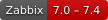
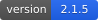
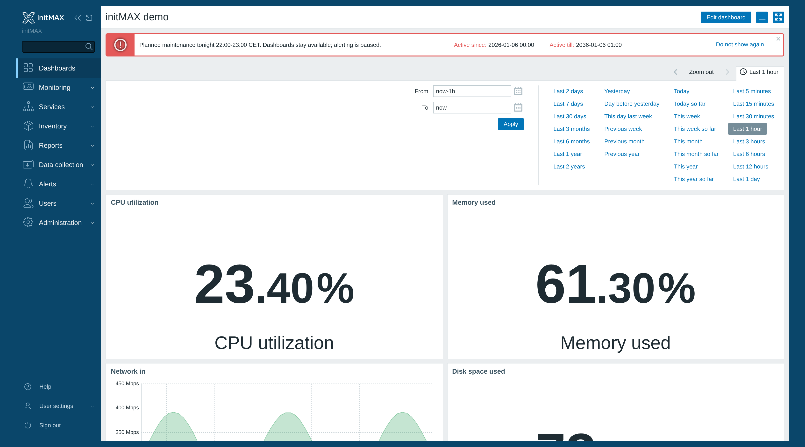
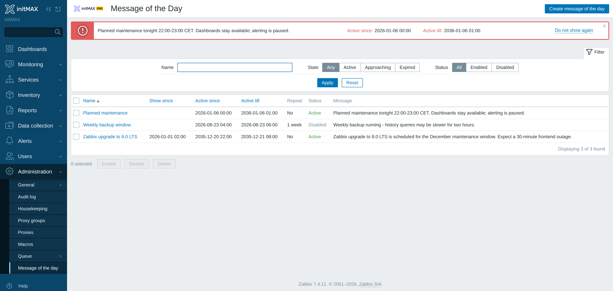
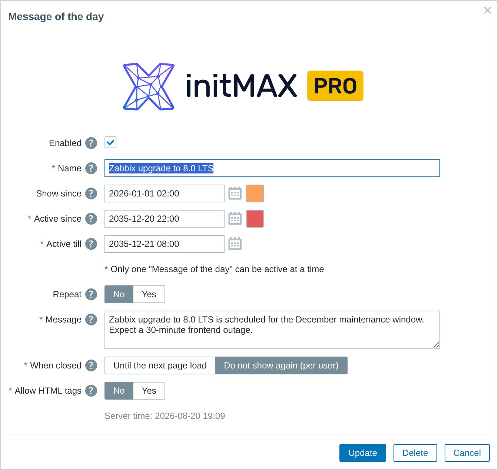
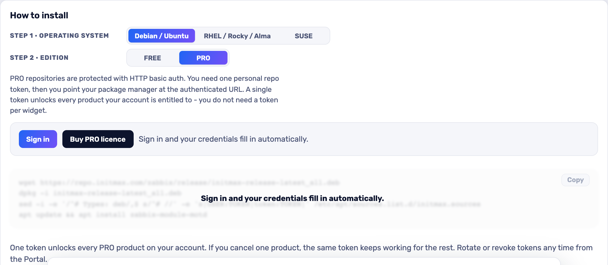

<h1>Message of the Day</h1>

developed and maintained by

and community

<strong>Tell everyone who opens Zabbix what is happening - before they ask.</strong> 
Planned maintenance, an incident, a migration window: write it once and it appears at the top of every page, for every user, only while it matters.

<a href="#what-you-can-build"><strong>Features</strong></a> &nbsp;·&nbsp;
<a href="#examples"><strong>Examples</strong></a> &nbsp;·&nbsp;
<a href="#install"><strong>Install</strong></a> &nbsp;·&nbsp;
<a href="#free-vs-pro"><strong>FREE vs PRO</strong></a> &nbsp;·&nbsp;
<a href="https://portal.initmax.com"><strong>Portal</strong></a> &nbsp;·&nbsp;
<a href="https://www.initmax.com/wiki/message-of-the-day/"><strong>Docs</strong></a>

 

---

## Why Message of the Day

Every maintenance window starts the same way: a mail nobody read, and then the tickets. **Message of the Day** puts the announcement where the people who need it already are - across the top of the Zabbix frontend, on every page, for every logged-in user. You give it a window and a colour, and it shows up on time and takes itself down afterwards.

## What you can build

<table>
<tr>
<td width="50%" valign="top">

**Planned maintenance**
Say what is happening, when, and what will still work - hours or days before it starts.

</td>
<td width="50%" valign="top">

**Live incidents**
One line at the top of every screen beats an inbox nobody is reading during an outage.

</td>
</tr>
<tr>
<td width="50%" valign="top">

**A warm-up window**
"Show since" puts the notice up early in a calmer colour, then switches to the alert colour when the window actually opens.

</td>
<td width="50%" valign="top">

**Housekeeping notices**
Upgrades, agent rollouts, template changes - anything the whole team should know without being told twice.

</td>
</tr>
<tr>
<td width="50%" valign="top">

**Recurring windows** &nbsp;PRO
A weekly backup or a monthly patch night announces itself every time, on its own.

</td>
<td width="50%" valign="top">

**Rich announcements** &nbsp;PRO
HTML in the body, for a link to the change ticket or the status page.

</td>
</tr>
</table>

## Examples

<table>
<tr>
<td width="50%" align="center" valign="top"> <small><b>Message list</b> - Administrators can review active, upcoming and past messages together with their display schedule.</small></td>
</tr>
</table>

## Configuration

Everything lives on one Administration page - **Administration → Message of the day**. A message has a name, a display window, a colour for the window and a colour for the run-up to it, the text itself. Every field carries a help hint. PRO adds the repetition controls, HTML in the body and the close mode - hide the bar until the next page load, or let each user put the message away for good (remembered in their profile, back the moment you change the message); in FREE those fields are shown greyed with a padlock, so you can see what PRO adds without installing it.

## Install

Both **FREE** and **PRO** ship as **GPG-signed `deb` / `rpm` packages** from the initMAX repository - `apt` / `dnf` installs them and keeps them updated. Same flow for both editions; PRO just adds your personal repo token.

### Easiest way - the guided installer on the Portal

Open the product page, pick your **OS** and **edition**, and copy the ready-made command. FREE is fully public (no login); PRO fills in your token once you sign in. There's a feedback box right there too.

<a href="https://portal.initmax.com/catalog/zabbix-motd#how-to-install"><strong>→ Open the installer on the Portal</strong></a>

Prefer a plain archive? Every release also ships as a **ZIP** - FREE [straight from the repo](https://repo.initmax.com/zabbix/free/zip/motd/), PRO with your repo token - handy for offline or manual installs.

The module is enabled automatically during the package installation - verify it in **Administration → General → Modules**. Done.

## FREE vs PRO

| Feature | FREE | PRO |
| ---------------------------------------------------------- | :----: | :----: |
| Announce a message to every user of the frontend | ✅ | ✅ |
| Display window, with its own colours before and during | ✅ | ✅ |
| Enable, disable and delete messages from a filtered list | ✅ | ✅ |
| One package for Zabbix 6.0 - 7.4 | ✅ | ✅ |
| Localised into all 25 Zabbix display languages | ✅ | ✅ |
| High availability ready | ✅ | ✅ |
| **Repeat a message every N days, weeks, months or years** | ❌ | ✅ |
| **End the repetition on a date or after a set number of runs** | ❌ | ✅ |
| **HTML in the message body, for links and emphasis** | ❌ | ✅ |
| **"Do not show again" - remembered per user, back when the message changes** | ❌ | ✅ |
| Licence | AGPLv3 | [Commercial](./LICENSE-PRO.md) |

## Requirements

|              |                                                              |
| ------------ | ------------------------------------------------------------ |
| **Zabbix**   | 6.0 · 6.2 · 6.4 · 7.0 · 7.2 · 7.4 - one package covers all    |
| **PHP**      | 7.4 or newer                                                 |
| **OS**       | Debian/Ubuntu · RHEL/Rocky/Alma/Oracle/Amazon · SUSE         |
| **Editions** | FREE (public repo) · PRO (token-gated repo)                  |
| **Permissions** | Super admin to write a message; every logged-in user sees it |
| **Languages** | All 25 Zabbix display languages - the module follows each user's own language setting |
| **High availability** | Ready. Messages live in the Zabbix database, not on the frontend node - install it on every node of an HA cluster and any node can serve it |

### Across Zabbix versions

One package carries both module trees and installs the right one for the frontend it finds - Zabbix accepts the older manifest format only below 6.4 and the newer one only from 6.4 up. Upgrading Zabbix under an installed module switches trees on its own; your messages and the module's settings are untouched.

The page, the form and the announcement itself are the same on all six versions - same fields, same labels, same order. Two differences are the frontend's, not the module's, and neither costs you a capability:

- The icon beside the announcement is drawn from each frontend's own icon set, so it looks native rather than identical.
- Up to Zabbix 6.4 the colour picker is Zabbix's older popup; from 7.4 it is the newer inline picker. Same stored colour either way.

## Support &amp; links

- **[Documentation / Wiki](https://www.initmax.com/wiki/message-of-the-day/)**
- **[Product page](https://www.initmax.com/product/message-of-the-day/)**
- **[Portal](https://portal.initmax.com)** - downloads, tokens, support tickets
- **Source code (FREE, AGPLv3)** - included in every package and published as a [source archive](https://repo.initmax.com/zabbix/free/zip/motd/) on repo.initmax.com
- **[support@initmax.com](mailto:support@initmax.com)**

---

FREE: <a href="https://www.gnu.org/licenses/agpl-3.0.html">AGPLv3</a> &nbsp;·&nbsp; PRO: <a href="./LICENSE-PRO.md">commercial</a> &nbsp;·&nbsp; © 2021-2026 initMAX s.r.o.

